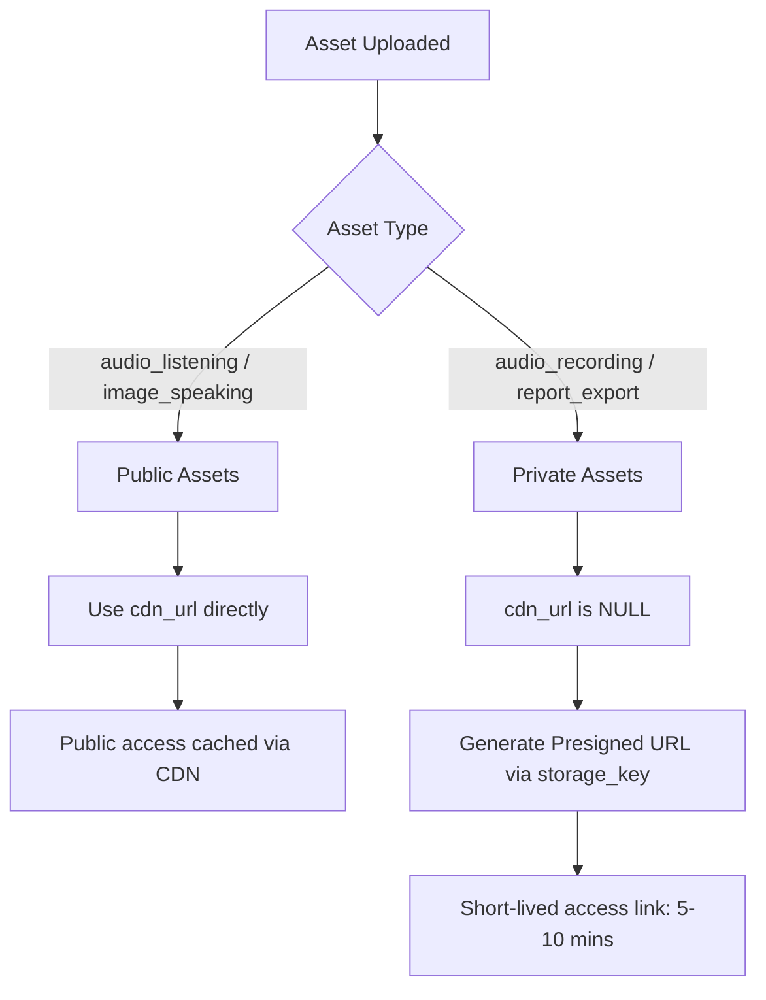

# Tài liệu thực thể Asset (Asset Entity Explanation)

Tài liệu này giải thích chi tiết về thiết kế cơ sở dữ liệu, phân loại, luồng hoạt động và cơ chế bảo mật của thực thể `Asset` trong hệ thống **Aptis LMS**.

---

## 1. Tổng quan (Overview)

Thực thể `Asset` dùng để quản lý tập trung toàn bộ các tệp tin (files) và phương tiện (media) của hệ thống. Thay vì lưu trữ tệp trực tiếp trong cơ sở dữ liệu (Database) dưới dạng dữ liệu nhị phân (BLOB/CLOB) — gây ảnh hưởng lớn đến hiệu năng và mở rộng — hệ thống sử dụng giải pháp:
1. **Lưu trữ vật lý:** File vật lý được đẩy lên dịch vụ **Cloud Storage** (AWS S3, Google Cloud Storage, v.v.).
2. **Lưu trữ logic:** Thông tin định danh, siêu dữ liệu (metadata), vị trí lưu trữ và chính sách bảo mật của file được quản lý bởi thực thể `Asset` trong cơ sở dữ liệu.

---

## 2. Chi tiết bảng dữ liệu `assets`

Bảng `assets` được định nghĩa trong cơ sở dữ liệu như sau:

| Tên cột (Column) | Kiểu dữ liệu | Ràng buộc | Giải thích |
| :--- | :--- | :--- | :--- |
| **`id`** | `UUID` | Primary Key | Định danh duy nhất toàn hệ thống của asset. |
| **`asset_type`** | `ENUM` | NOT NULL | Phân loại loại tệp tin: `AUDIO_QUESTION`, `IMAGE_QUESTION`, `AUDIO_RECORDING`. |
| **`storage_key`** | `VARCHAR(1024)` | NOT NULL | Đường dẫn/Object Key thực tế của file trên Cloud Storage (ví dụ: `/audio/listening/q1.mp3`). |
| **`cdn_url`** | `VARCHAR(1024)` | | URL công khai của file được phân phối qua CDN (như Cloudflare, CloudFront). Để `NULL` đối với các tệp tin bảo mật. |
| **`filename`** | `VARCHAR(255)` | NOT NULL | Tên gốc của tệp tin khi người dùng tải lên. |
| **`size_bytes`** | `BIGINT` | NOT NULL | Dung lượng file tính bằng bytes. |
| **`mime_type`** | `VARCHAR(128)` | NOT NULL | Kiểu định dạng file (ví dụ: `audio/mpeg`, `image/png`, `application/pdf`). |
| **`uploaded_by`** | `UUID` | FK -> `users` | ID người dùng đã tải tệp tin lên. Để trống (`NULL`) nếu do hệ thống tự động tạo ra. |
| **`tenant_id`** | `UUID` | FK -> `tenants` | Phục vụ kiến trúc Multi-tenant. `NULL` đối với tài nguyên dùng chung hệ thống. |
| **`created_at`** | `TIMESTAMP` | NOT NULL | Thời gian tạo/tải lên. |
| **`expires_at`** | `TIMESTAMP` | | Thời điểm file hết hạn và tự động bị xóa (dành cho file xuất báo cáo tạm thời). `NULL` tức là lưu trữ vĩnh viễn. |

---

## 3. Phân tích chi tiết về `storage_key` và `cdn_url`

Sự tách biệt giữa `storage_key` và `cdn_url` là điểm mấu chốt để hệ thống đảm bảo cả **hiệu năng (performance)** lẫn **bảo mật (security)**. Dưới đây là phân tích chi tiết:

### 3.1. `storage_key` (Đường dẫn vật lý - Logical Key)
* **Khái niệm:** Là đường dẫn tương đối (Object Key/Path) của file bên trong bucket của Cloud Storage (ví dụ: `questions/listening/part_1_audio.mp3` hoặc `recordings/tenant_1/attempt_45/speaking_part_b.wav`).
* **Tại sao không lưu URL tuyệt đối (như `https://s3.amazonaws.com/my-bucket/...`)?**
  * **Tránh phụ thuộc môi trường:** Nếu đổi tên bucket, chuyển từ AWS S3 sang Google Cloud Storage, hoặc chạy trên môi trường khác nhau (Dev, Staging, Production), hệ thống chỉ cần thay đổi cấu hình kết nối (Base URL) ở tệp cấu hình ứng dụng (`application.properties`) thay vì phải chạy script cập nhật hàng triệu dòng trong Database.
  * **An toàn thông tin:** Che giấu cấu trúc thực tế của hệ thống lưu trữ bên dưới đối với người dùng cuối.
* **Quyền truy cập:** Chỉ có Backend Service (sử dụng Access Key / IAM Role nội bộ có quyền đọc/ghi vào bucket) mới được phép dùng `storage_key` này để tương tác trực tiếp với file.

### 3.2. `cdn_url` (Đường dẫn phân phối - Delivery URL)
* **Khái niệm:** Là URL tuyệt đối trỏ qua mạng lưới phân phối nội dung CDN (ví dụ: `https://cdn.aptis-lms.com/questions/listening/part_1_audio.mp3`).
* **Vai trò:**
  * **Tăng tốc độ tải (Caching):** CDN có các máy chủ biên (Edge Servers) phân tán toàn cầu. Khi học sinh tải một file nghe, CDN sẽ lưu lại bản sao của file đó ở máy chủ gần học sinh nhất. Những học sinh tiếp theo tải file đó sẽ nhận được ngay lập tức từ máy chủ biên mà không cần gọi về Server gốc ở Singapore/Mỹ.
  * **Tiết kiệm chi phí:** Giảm băng thông (Bandwidth Out) trực tiếp từ Cloud Storage (vốn rất đắt đỏ) và giảm tải cho Backend API.
* **Tại sao trường này có thể là `NULL`?**
  * CDN sinh ra để **bộ nhớ đệm công khai (Public Cache)**.
  * Nếu là file riêng tư (như ghi âm bài thi Nói của học sinh, file bảng điểm PDF), file **không được phép** lưu trên CDN công cộng để tránh việc người khác mò ra link tải về. Vì vậy, hệ thống đặt `cdn_url = NULL` và bắt buộc truy cập qua cơ chế **Presigned URL** (đường link tạm thời do Backend sinh ra từ `storage_key`, chỉ có hiệu lực trong vài phút).

### 3.3. Bảng so sánh giữa `storage_key` và `cdn_url`

| Đặc điểm | `storage_key` | `cdn_url` |
| :--- | :--- | :--- |
| **Mục đích** | Xác định vị trí lưu trữ gốc của file. | Phân phối file nhanh chóng đến người dùng cuối. |
| **Độ tin cậy** | Vĩnh viễn (chỉ đổi khi file bị xóa vật lý). | Có thể thay đổi nếu cấu hình lại tên miền/CDN. |
| **Tầm vực truy cập** | Nội bộ (Backend ứng dụng). | Công khai (Frontend / Client). |
| **Độ bảo mật** | Tuyệt đối bảo mật (Nằm sau tường lửa/IAM). | Công khai (Bất kỳ ai có link đều tải được). |
| **Áp dụng cho** | Tất cả các loại Asset (bắt buộc). | Chỉ áp dụng cho Asset công khai (`audio_listening`, `image_speaking`). |

---

## 4. Phân loại Asset & Cơ chế Bảo mật

Dựa vào giá trị của cột `asset_type`, hệ thống chia các tệp thành hai nhóm bảo mật chính:

### 4.1. Nhóm Công khai (Public Assets)
*   **Các loại:** `audio_listening` (âm thanh bài thi nghe), `image_speaking` (ảnh đề thi nói).
*   **Đặc điểm:** Cần được hiển thị nhanh cho số lượng lớn học sinh cùng lúc vào thi. Không mang tính bảo mật cá nhân của thí sinh.
*   **Cơ chế:**
    *   Cột `cdn_url` được cấu hình để trỏ trực tiếp đến máy chủ **CDN (Content Delivery Network)** biên gần người dùng nhất.
    *   Học sinh tải trực tiếp dữ liệu từ CDN giúp giảm tải tối đa cho Backend API và tối ưu tốc độ phản hồi.

### 4.2. Nhóm Riêng tư (Private Assets)
*   **Các loại:** `audio_recording` (file ghi âm bài nói của thí sinh), `report_export` (báo cáo điểm của tổ chức).
*   **Đặc điểm:** Chứa thông tin cá nhân của thí sinh và kết quả học tập. **Tuyệt đối không được rò rỉ hoặc lưu trữ trên các CDN công cộng**.
*   **Cơ chế:**
    *   Cột `cdn_url` được đặt là **`NULL`**.
    *   Mỗi khi người dùng (như giáo viên chấm thi) muốn nghe bài nói, Backend sẽ thực hiện kiểm tra quyền (Authorization).
    *   Nếu được phép, Backend sử dụng `storage_key` để gọi lên Cloud Storage sinh ra một **đường dẫn tạm thời (Presigned URL/Signed URL)** có hiệu lực ngắn hạn (ví dụ: 5 phút). Giáo viên sẽ nghe qua URL tạm này. Hết hạn, URL sẽ vô hiệu.

---

## 5. Luồng hoạt động chính (Workflows)

### 5.1. Luồng tải lên (Upload Workflow)
1. Frontend gửi yêu cầu tải tệp lên hoặc hệ thống tự động tạo tệp.
2. File được tải lên Cloud Storage và trả về đường dẫn `storage_key`.
3. Hệ thống tạo bản ghi mới trong bảng `assets` để lưu trữ thông tin file.
4. Trả về `UUID` (ID của asset) cho thực thể liên kết (ví dụ: liên kết vào `audio_asset_id` của bảng `questions`).

### 5.2. Luồng truy xuất (Access Workflow)
*   **Nếu asset là Public (`cdn_url != null`):** 
    *   API trả thẳng chuỗi `cdn_url` cho Frontend hiển thị.
*   **Nếu asset là Private (`cdn_url == null`):**
    *   Frontend gọi API yêu cầu truy cập tài nguyên bảo mật bằng `asset_id`.
    *   Backend kiểm tra quyền hạn của người dùng hiện tại đối với tài nguyên liên quan.
    *   Nếu hợp lệ, Backend sinh **Presigned URL** từ `storage_key` và trả về cho Frontend.

### 5.3. Luồng tự động dọn dẹp (Cleanup Workflow)
*   Các file xuất báo cáo (`report_export`) có cấu hình cột `expires_at` cụ thể (ví dụ: sau 7 ngày kể từ lúc tạo).
*   Một tiến trình chạy ngầm (Cron job / Background Worker) định kỳ sẽ quét bảng `assets` để:
    1. Tìm các bản ghi có `expires_at < CURRENT_TIMESTAMP`.
    2. Thực hiện xóa file vật lý tương ứng trên Cloud Storage dựa vào `storage_key`.
    3. Xóa bản ghi đó ra khỏi database.
