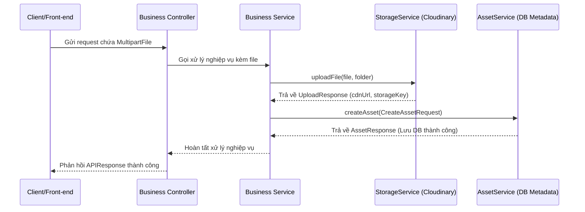

# Storage Module Overview

Module `storage` chịu trách nhiệm tích hợp và giao tiếp với các dịch vụ lưu trữ đám mây bên thứ ba (hiện tại là Cloudinary). Được thiết kế theo nguyên lý thiết kế độc lập (independent module), lỏng liên kết (loose coupling) để các module nghiệp vụ khác có thể dễ dàng tải lên hoặc xóa các tệp tin mà không bị phụ thuộc vào SDK bên thứ ba.

---

## 1. Cấu trúc thư mục (File Structure)

Module được tổ chức tại package `com.aptis.modules.storage`:

```
com.aptis.modules.storage/
├── config/
│   └── CloudinaryConfig.java       # Cấu hình Bean Cloudinary từ Spring Environment
├── constant/
│   └── StorageConstants.java       # Định nghĩa các hằng số chuỗi (key, folder, message)
├── domain/
│   └── exception/
│       └── StorageException.java   # Custom unchecked exception cho các lỗi storage
├── dto/
│   └── response/
│       └── UploadResponse.java     # DTO record chứa thông tin file sau khi upload thành công
├── interfaces/
│   └── StorageService.java         # Interface định nghĩa hành vi lưu trữ (SOLID - ISP)
└── service/
    └── CloudinaryServiceImpl.java  # Triển khai interface StorageService tương tác với Cloudinary SDK
```

---

## 2. Cấu hình Môi trường (Configuration)

Để kích hoạt module, cần bổ sung các cấu hình sau:

### File `.env` (Local Development / Docker runtime)
```properties
CLOUDINARY_CLOUD_NAME=your_cloud_name
CLOUDINARY_API_KEY=your_api_key
CLOUDINARY_API_SECRET=your_api_secret
```

### File `application.properties`
```properties
# Cloudinary Config
cloudinary.cloud-name=${CLOUDINARY_CLOUD_NAME}
cloudinary.api-key=${CLOUDINARY_API_KEY}
cloudinary.api-secret=${CLOUDINARY_API_SECRET}
```

### Quy tắc lưu trữ mặc định (Storage Defaults)
Để quản lý và phân loại tệp tin đồng nhất, module sử dụng các cấu hình mặc định sau:
* **Upload Preset**: Mặc định sử dụng `aptis_upload_preset` được định nghĩa trong `StorageConstants.VAL_UPLOAD_PRESET`.
* **Folder**: Thư mục gốc lưu trữ mặc định là `aptis`. Khi truyền vào một subfolder (ví dụ: `questions`), tệp tin sẽ được lưu tại thư mục `aptis/questions` trên Cloudinary. Nếu không truyền hoặc truyền rỗng, tệp tin sẽ nằm trực tiếp ở thư mục gốc `aptis`.

---

## 3. Luồng Tải File Lên (Upload Workflow)

Kiến trúc tách biệt giữa **lưu trữ tệp vật lý (Storage)** và **lưu trữ metadata (Asset)**. Khi một module nghiệp vụ cần upload ảnh/âm thanh:



---

## 4. Hướng dẫn Sử dụng (Integration Guide)

Để gọi upload/delete file từ một service khác, bạn chỉ cần Inject interface `StorageService`.

### 4.1. Tải tệp lên (Upload File)
```java
package com.aptis.modules.questionbank.service;

import org.springframework.stereotype.Service;
import org.springframework.web.multipart.MultipartFile;
import com.aptis.modules.storage.interfaces.StorageService;
import com.aptis.modules.storage.dto.response.UploadResponse;
import com.aptis.modules.storage.constant.StorageConstants;

@Service
public class QuestionServiceImpl implements QuestionService {

    private final StorageService storageService;

    public QuestionServiceImpl(StorageService storageService) {
        this.storageService = storageService;
    }

    public void createQuestionMedia(MultipartFile file) {
        // Tải ảnh lên thư mục "questions" của Cloudinary
        UploadResponse uploadResult = storageService.uploadFile(file, StorageConstants.FOLDER_QUESTIONS);
        
        String cdnUrl = uploadResult.cdnUrl();         // Lưu URL CDN này vào thực thể câu hỏi
        String storageKey = uploadResult.storageKey(); // publicId dùng để quản lý hoặc xóa file sau này
    }
}
```

### 4.2. Xóa tệp (Delete File)
Để xóa tệp vật lý khỏi Cloudinary, chỉ cần gọi hàm `deleteFile` truyền vào `storageKey` (public_id) đã lưu trước đó:
```java
public void deleteQuestionMedia(String storageKey) {
    storageService.deleteFile(storageKey);
}
```

---

## 5. Xử lý Lỗi (Exception Handling)

Tất cả các lỗi phát sinh từ kết nối mạng hoặc lỗi phản hồi của SDK bên thứ ba đều được bọc trong `StorageException` (kế thừa `RuntimeException`).

* Nếu tệp truyền vào rỗng hoặc null: ném ra `StorageException` với message `Cannot upload an empty file`.
* Nếu quá trình kết nối với API Cloudinary gặp sự cố: ném ra `StorageException` với message `Failed to upload file to Cloudinary storage`.
* Lỗi xóa tệp: ném ra `StorageException` với message `Failed to delete file from Cloudinary storage`.
